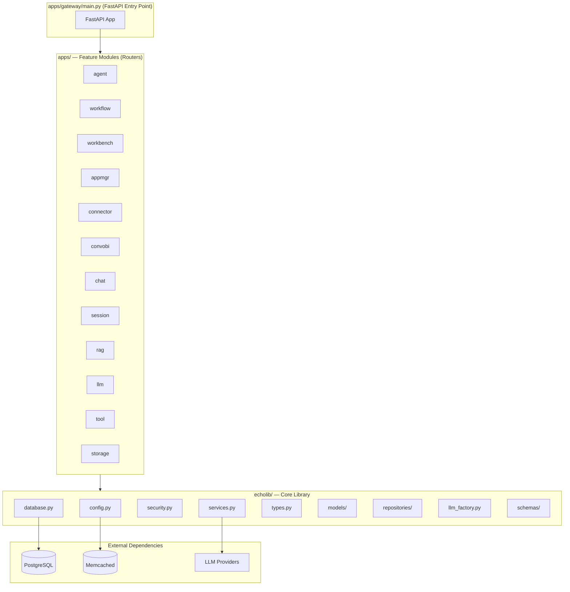

# EchoAI Production — Codebase Understanding

> **Last updated:** 2026-02-15  
> **Platform:** EchoAI — An AI Agent Orchestration & Workflow Platform

---

## 1. High-Level Architecture

EchoAI is a **monolithic FastAPI application** (with a micro-services option via `SERVICE_MODE`) that enables users to:

1. **Design AI agents** from natural language prompts or templates
2. **Build multi-agent workflows** (sequential, parallel, hierarchical)
3. **Execute workflows** using LangGraph (topology/state) + CrewAI (agent collaboration)
4. **Manage full applications** (CRUD wizard with personas, guardrails, data sources)
5. **Chat with agents/workflows** in real-time via WebSocket
6. **Connect external tools** via API connectors and MCP (Model Context Protocol)
7. **Query databases** conversationally (ConvoBI module)
8. **Use RAG** — traditional, vector-based (FAISS), graph-based, and hybrid



---

## 2. Project Structure

```
echoAI-Production/
├── apps/                          # Feature modules (FastAPI routers)
│   ├── agent/                     # Agent design, registry, factory, permissions
│   ├── workflow/                  # Workflow design, validation, execution, runtime
│   ├── workbench/                 # UI workbench services
│   ├── appmgr/                   # Application CRUD orchestrator (wizard)
│   ├── connector/                 # Database connectors (Oracle, MSSQL, etc.)
│   ├── convobi/                   # Conversational BI (SQL from natural language)
│   ├── chat/                      # Chat session management
│   ├── session/                   # Session CRUD + WebSocket chat
│   ├── rag/                       # RAG indexing and querying
│   ├── llm/                       # LLM model management
│   ├── tool/                      # Tool registry, executor, storage
│   ├── storage/                   # Agent templates JSON + tool storage
│   └── gateway/                   # Main FastAPI app (entry point)
│
├── echolib/                       # Core library (shared across all apps)
│   ├── config.py                  # Settings: DB, LLM, memcached, JWT, auth
│   ├── database.py                # Async SQLAlchemy engine + session management
│   ├── security.py                # JWT auth middleware + user context
│   ├── services.py                # Business logic (3,785 lines — the heart)
│   ├── types.py                   # Domain models (Pydantic): Agent, Workflow, Tool, RAG types
│   ├── llm_factory.py             # LLM model instantiation via config
│   ├── cache.py                   # Memcached session caching
│   ├── di.py                      # Dependency injection container
│   ├── interfaces.py              # Abstract interfaces (ILogger, IEventBus, etc.)
│   ├── adapters.py                # Adapter implementations
│   ├── models/                    # SQLAlchemy ORM models (PostgreSQL)
│   ├── repositories/              # Async CRUD repositories
│   ├── schemas/                   # JSON validation schemas
│   ├── service/                   # Specialized services
│   │   ├── agents/                # Agent-specific service logic
│   │   └── rag/                   # RAG services (graph, hybrid, vector, traditional)
│   ├── Get_connector/             # External connector integrations
│   │   ├── Get_API/               # API connector framework
│   │   └── Get_MCP/               # MCP connector framework
│   ├── LLM_Details/               # LLM provider configuration & management
│   │   ├── Core/                  # LLM client builder, config loader, model wrapper
│   │   ├── Providers/             # Provider-specific implementations
│   │   └── Exceptions/            # LLM-specific exceptions
│   └── persona_templates/         # Persona template files
│
├── AgentTools/                    # Built-in agent tools
│   ├── calculator/                # Math calculator tool
│   ├── code_generator/            # Code generation tool
│   ├── code_reviewer/             # Code review tool
│   ├── file_reader/               # File reading/parsing tool
│   ├── web_search/                # Web search integration tool
│   └── math/                      # Advanced math tool
│
├── llm_manager.py                 # Centralized LLM singleton (LangChain + CrewAI)
├── llm_provider.json              # Cloud LLM provider configurations
├── llm_provider_onprem.json       # On-premise LLM provider configurations
├── alembic/                       # Database migrations
├── deploy/k8s/                    # Kubernetes deployment manifests
├── tests/                         # Test suite
├── scripts/                       # Utility scripts
└── requirements.txt               # Python dependencies
```

---

## 3. Core Library (`echolib/`)

### 3.1 Configuration (`config.py`)

Two Pydantic settings classes loaded from `.env`:

| Class | Key Settings |
|-------|-------------|
| **`LLMSettings`** | `use_ollama`, `use_openrouter`, `use_azure`, `use_openai` (one active at a time), provider URLs, API keys, default temperature/tokens |
| **`Settings`** | `app_name`, `service_mode` (mono/micro), `database_url` (PostgreSQL+asyncpg), `memcached_*`, `jwt_*`, `auth_enforcement` (optional/required), `transparency_enabled` |

### 3.2 Database (`database.py`)

- **Async SQLAlchemy 2.0** with `asyncpg` driver
- Lazy-initialized engine and session factory
- Context manager `get_db_session()` with auto commit/rollback
- Lifespan management via `database_lifespan()`

### 3.3 Security (`security.py`)

- **JWT-based auth** with HS256
- Two modes: `optional` (anonymous fallback) / `required` (401 on missing token)
- `AuthMiddleware` extracts user from Bearer token to `request.state.user`
- Dependencies: `get_current_user`, `require_user`

### 3.4 Types (`types.py`) — 612 lines

Core domain Pydantic models:

| Category | Types |
|----------|-------|
| **Basic** | `Event`, `Session`, `UserContext`, `Document`, `LLMOutput` |
| **Graph RAG** | `Entity`, `Relationship`, `GraphDocument`, `GraphQueryResult`, `GraphStats` |
| **Tool System** | `ToolType` (LOCAL/MCP/API/CREWAI), `ToolDef`, `ToolRef`, `ToolResult` |
| **Agent/Workflow** | `AgentTemplate`, `Agent`, `Workflow`, `WorkflowMode` (SEQUENTIAL/PARALLEL/HIERARCHICAL) |
| **Connector** | `ConnectorConfig`, `ConnectorType`, `AuthType` |

### 3.5 Services (`services.py`) — 3,785 lines (the heart of the platform)

| Service | Responsibility |
|---------|---------------|
| **`DocumentStore`** | In-memory document storage |
| **`StateStore`** | In-memory key-value state |
| **`ToolService`** | Tool registration, listing, invocation |
| **`RAGService`** | Document indexing (legacy + vector), querying, vectorization |
| **`LLMService`** | Thin wrapper over `LLMFactory` — model creation, caching, custom model registration |
| **`AgentService`** | ★ **Largest class** (~1,600 lines) — intent analysis, template matching, LLM-powered agent creation, update detection, agent-to-agent validation, canvas card creation |
| **`WorkflowService`** | Workflow creation from prompt/canvas, validation, publishing |
| **`ConnectorManager`** | Routes to `APIConnector` or `MCPConnector` |
| **`MCPConnector`** | MCP connector CRUD with testing, invocation, storage |
| **`APIConnector`** | API connector CRUD with 3-level validation, auth management, deep merge updates |

### 3.6 Models (`echolib/models/`)

SQLAlchemy ORM models backed by PostgreSQL with JSONB for definitions:

| Model | Purpose |
|-------|---------|
| `User` | Authenticated user accounts |
| `Agent` | AI agent definitions (synced from workflow saves) |
| `Workflow` / `WorkflowVersion` | Workflow definitions + immutable version snapshots |
| `ChatSession` | Chat sessions with embedded messages |
| `SessionToolConfig` | Per-session tool configuration overrides |
| `Tool` | User-owned tool definitions |
| `Execution` / `HITLCheckpoint` | Workflow execution runs + HITL state |
| `Application` + link tables | App wizard (LLM, skill, data source, designation, BU, tag, guardrail links) |
| `ApplicationChatSession/Message` | App-level chat sessions and messages |
| `ApplicationDocument` | Uploaded docs for app-level RAG |
| `ApplicationExecutionTrace` | Orchestration audit trail |
| Lookups: `AppPersona`, `AppGuardrailCategory`, `AppDesignation`, `AppBusinessUnit`, `AppTag`, `AppLlm`, `AppDataSource` | Catalog/reference tables |

### 3.7 Repositories (`echolib/repositories/`)

Async CRUD repositories with a `BaseRepository` pattern:
- `agent_repo.py`, `application_repo.py`, `application_chat_repo.py`
- `execution_repo.py`, `session_repo.py`, `session_tool_config_repo.py`
- `tool_repo.py`, `user_repo.py`, `workflow_repo.py`

### 3.8 RAG Services (`echolib/service/rag/`)

| File | Purpose |
|------|---------|
| `trad_rag.py` | Traditional keyword-based RAG |
| `vector_store.py` | FAISS vector store with embeddings |
| `graph_rag_service.py` | Knowledge graph-based RAG (entity/relationship extraction) |
| `hybrid_rag_service.py` | Combines multiple RAG strategies |
| `session_rag_manager.py` | Per-session RAG context management |

---

## 4. Application Modules (`apps/`)

### 4.1 Gateway (`apps/gateway/main.py`) — Entry Point

- Creates the main `FastAPI` application
- **Lifespan**: initializes DB pool + Memcached, disposes on shutdown
- **Middleware**: CORS (all origins), `AuthMiddleware`, tool operations logging
- **Mounts**: all 12 routers + static files
- **Endpoints**: `/healthz`, `/health/db`, `/health/cache`, WebSocket `/ws/execution/{run_id}`

### 4.2 Agent Module (`apps/agent/`)

| Component | File | Purpose |
|-----------|------|---------|
| Routes | `routes.py` (786 lines) | Agent CRUD, design from prompt, registry management, factory, permissions, templates, intent classification, DB persistence |
| Designer | `designer/` | AI-powered agent design from natural language |
| Factory | `factory/` | Runtime agent instantiation with tool binding |
| Registry | `registry/` | In-memory agent registration and lookup |
| Permissions | `permissions/` | Agent-to-agent communication validation |

### 4.3 Workflow Module (`apps/workflow/`) — **Largest module**

| Component | File | Purpose |
|-----------|------|---------|
| Routes | `routes.py` (1,685 lines) | Workflow design, validation, execution, storage, visualization, chat sessions, DB persistence |
| Designer | `designer/designer.py` (61KB) | LLM-powered workflow design from natural language |
| Compiler | `designer/compiler.py` (71KB) | Compiles workflow definitions into executable LangGraph |
| CrewAI Adapter | `crewai_adapter.py` (57KB) | Bridges CrewAI into LangGraph nodes for agent collaboration |
| Validator | `validator/` | Sync + async validation rules, retry logic, error types |
| Visualization | `visualization/` | Graph visualization (node_mapper, graph_mapper, graph_editor) |
| Storage | `storage/` | Filesystem-based workflow storage (draft/temp/final), session storage |
| **Runtime** | `runtime/` | Execution engine (see below) |

#### Workflow Runtime (`apps/workflow/runtime/`)

| File | Purpose |
|------|---------|
| `executor.py` | Main workflow execution engine |
| `chat_session.py` | Interactive chat within running workflows |
| `hitl.py` | Human-in-the-loop checkpointing and approval |
| `event_publisher.py` | Custom event publishing for execution steps |
| `transparency.py` | Execution transparency (step-level events) |
| `ws_manager.py` | WebSocket connection management for live updates |
| `guards.py` | Execution guardrails and safety checks |
| `checkpoints.py` | State checkpointing for resumable workflows |
| `telemetry.py` | Execution telemetry and metrics |

### 4.4 Application Manager (`apps/appmgr/`)

| File | Purpose |
|------|---------|
| `routes.py` (1,358 lines) | Full Application CRUD (create, list, get, update, delete), step-based patching (setup, access, context, guardrails, publishing), lookup catalogs CRUD, chat & document management |
| `main.py` (26KB) | Application orchestrator business logic |
| `orchestrator/` | Sub-module for orchestration logic |
| `schemas.py` (12KB) | Pydantic schemas for all request/response models |

### 4.5 Connector Module (`apps/connector/`)

- `db_connector.py` (51KB) — Database connector supporting Oracle, MSSQL, PostgreSQL, etc.
- `routes.py` (26KB) — Connector CRUD API
- Persistent storage via `saved_db_connections.json`

### 4.6 ConvoBI Module (`apps/convobi/`)

- `main.py` (138KB) — **Largest single file** — Conversational Business Intelligence
- Generates SQL from natural language, executes against connected databases
- `column_glossary.py` — Column metadata and glossary management
- `routes.py` — API routes for ConvoBI

### 4.7 Tool Module (`apps/tool/`)

| File | Purpose |
|------|---------|
| `registry.py` (21KB) | Tool registration, discovery, and lookup |
| `executor.py` (19KB) | Tool invocation engine (LOCAL/MCP/API dispatch) |
| `storage.py` (10KB) | Persistent tool storage |
| `routes.py` (16KB) | Tool CRUD + execution API |

### 4.8 Other Modules

| Module | Purpose |
|--------|---------|
| `session/` | Session CRUD + real-time WebSocket chat |
| `rag/` | RAG indexing and query endpoints |
| `llm/` | LLM model listing, selection, custom model management |
| `chat/` | Basic chat routing |
| `workbench/` | Workbench UI services |
| `storage/` | Static agent templates + tool definitions |

---

## 5. LLM Integration

### Multi-Provider Support

```
LLM Providers
├── OpenRouter (default for development)
├── Azure OpenAI (for Azure deployment)
├── Direct OpenAI
├── Ollama (on-premise)
└── Anthropic (Claude)
```

### Three LLM Entry Points

| Entry Point | File | Purpose |
|-------------|------|---------|
| `LLMManager` | `llm_manager.py` | Singleton with class methods — convenience `get_llm()` / `get_crewai_llm()` |
| `LLMFactory` | `echolib/llm_factory.py` | Config-driven factory — `get_model()` with caching, custom model registration |
| `LLMService` | `echolib/services.py` | Service layer wrapping `LLMFactory` for DI integration |

### Execution Model

```
LangGraph (Topology Owner)
├── Sequential nodes → CrewAI single-agent crews
├── Parallel nodes → CrewAI multi-agent crews
├── Hierarchical nodes → CrewAI Manager + Worker crews
└── State management, branching, merging
```

**Key rule:** LangGraph OWNS workflow topology; CrewAI is ONLY invoked INSIDE LangGraph node functions.

---

## 6. Agent Tools (`AgentTools/`)

Built-in tools available to agents:

| Tool | Purpose |
|------|---------|
| `calculator` | Mathematical calculations |
| `code_generator` | Code generation from natural language |
| `code_reviewer` | Automated code review |
| `file_reader` | File reading and parsing (multiple formats) |
| `web_search` | Web search integration |
| `math` | Advanced mathematical operations |

Additional tools can be registered dynamically via the Tool Registry (LOCAL, MCP, or API types).

---

## 7. Database & Persistence

| Technology | Usage |
|-----------|-------|
| **PostgreSQL** (asyncpg) | Primary database — all models via SQLAlchemy 2.0 async |
| **Alembic** | Database migrations |
| **Memcached** | Optional session caching (configurable TTL, fallback to DB) |
| **Filesystem** | Workflow storage (draft/temp/final), connector configs, tool storage |
| **SQLite** | Legacy app wizard DB (`apps_wizard_new.db`) |

---

## 8. Deployment

- **Kubernetes** manifests in `deploy/k8s/` (base + overlays)
- **Service mode**: `mono` (single process) or `micro` (microservices)
- **Auth enforcement**: configurable via `AUTH_ENFORCEMENT` env var

---

## 9. Testing

| Test File | Scope |
|-----------|-------|
| `test_crewai_adapter.py` | CrewAI integration testing |
| `test_workflow_integration.py` | End-to-end workflow tests |
| `test_workflow_types.py` | Workflow type validation |
| `test_health.py` | Health check endpoint test |

---

## 10. Key Design Patterns

1. **Repository Pattern** — All DB access via async repository classes with a shared `BaseRepository`
2. **Dependency Injection** — `echolib/di.py` container + per-module `container.py` files
3. **Factory Pattern** — `LLMFactory` for model creation, `AgentFactory` for runtime instances
4. **Template Matching + LLM Fallback** — Agent creation first tries template matching, falls back to full LLM generation
5. **JSONB Definitions** — ORM models store complete definitions as JSONB; only key fields extracted for indexing
6. **Layered Services** — Routes → Services → Repositories → Database
7. **Event-Driven Execution** — WebSocket-based execution transparency with step-level events
8. **HITL (Human-in-the-Loop)** — Checkpoint-based approval flows within workflow execution
